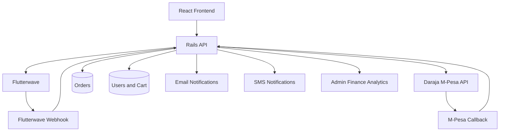

# Maddox Gaming

Maddox Gaming is a React + Rails commerce and community platform with integrated Kenyan payments, order tracking, retryable checkouts, finance analytics, and notification delivery.

## Overview

This project combines:

- A React frontend for storefront browsing, cart management, checkout, and community experiences.
- A Rails API backend for authentication, cart sync, orders, payments, analytics, and notifications.
- Flutterwave for secure card checkout.
- Daraja for direct M-Pesa STK Push.
- Backend-confirmed order status updates through verification and webhooks.
- Admin finance views for revenue tracking and payment monitoring.

## Core Features

- Product browsing and cart management.
- Checkout with card or M-Pesa.
- Pending, paid, and failed order lifecycle tracking.
- Payment retry for orders that did not complete successfully.
- Recent order history in the checkout experience.
- Finance analytics for daily revenue, payment mix, and recent confirmed payments.
- Email payment confirmations through Action Mailer.
- SMS payment confirmations through a configurable HTTP SMS provider.

## Architecture



## Payment Flows

### Card Checkout

1. The frontend creates a pending order through the Rails API.
2. The backend returns a Flutterwave checkout configuration.
3. The frontend opens the Flutterwave payment modal.
4. The backend verifies the transaction and also accepts Flutterwave webhook confirmation.
5. The order is marked `paid` or `failed` only on the backend.

### M-Pesa Checkout

1. The frontend creates a pending order through the Rails API.
2. The backend triggers Daraja STK Push.
3. The customer receives an M-Pesa prompt on their phone.
4. Daraja calls back into the backend callback endpoint.
5. The order is updated to `paid` or `failed`, and confirmation notifications are sent.

### Retry Flow

1. A failed or pending order can be retried from the checkout UI.
2. The backend reopens the order in a controlled `pending` state.
3. Card retries use Flutterwave again.
4. M-Pesa retries trigger a fresh Daraja STK Push.

## Project Structure

```text
src/                 React frontend
backend/             Rails API backend
public/              Static frontend assets
scripts/             Smoke and utility scripts
dist/                Vite production build output
```

## Local Development Setup

### 1. Frontend Environment

Copy `.env.example` to `.env` and configure:

- `VITE_API_URL`
- `VITE_FLUTTERWAVE_PUBLIC_KEY`
- `VITE_CABLE_URL` if needed.

The example file is already pointed at the deployed backend:

- `VITE_API_URL=https://maddox-gaming.onrender.com/api/v1`
- `VITE_CABLE_URL=wss://maddox-gaming.onrender.com/cable`

### 2. Backend Environment

See [backend/README.md](backend/README.md) and `backend/.env.example` for:

- Flutterwave keys for card payments.
- Daraja credentials for M-Pesa STK Push.
- SMTP settings for email confirmations.
- SMS provider settings for SMS confirmations.

The backend examples use these deployed defaults:

- `BASE_URL=https://maddox-gaming.onrender.com`
- `APP_HOST=maddox-gaming.onrender.com`
- `MPESA_CALLBACK_URL=https://maddox-gaming.onrender.com/api/mpesa/callback`

### 3. Install Dependencies

Frontend:

```bash
npm install
```

Backend:

```bash
cd backend
bundle install
bin/rails db:migrate
```

If bundler permissions fail in WSL:

```bash
bundle config set --local path vendor/bundle
bundle install
```

### 4. Start the App

Backend:

```bash
cd backend
bin/rails server
```

Frontend:

```bash
npm start
```

Default local URLs:

- Frontend: `http://localhost:3001`
- Backend API: `http://localhost:3000/api/v1`

## Local Testing Checklist

Use this sequence when testing payments locally:

1. Start the Rails API.
2. Start the React frontend.
3. Confirm both `.env` files are populated.
4. Use a public callback URL when testing real Flutterwave or Daraja webhooks.
5. Test both a card checkout and an M-Pesa checkout.
6. Trigger one failed payment and confirm retry works.
7. Check admin finance pages for updated revenue data.
8. Check `backend/tmp/mails` in development if SMTP is not configured.

## Recommended Screenshots To Add

If you want this README to become portfolio-ready, these are the best screenshots to add:

1. Home or storefront landing page.
2. Checkout page showing card and M-Pesa options.
3. M-Pesa “check your phone” checkout state.
4. Recent orders list with retry action.
5. Admin finance dashboard with daily revenue and payment mix.

## Deployment Steps

### Netlify Frontend

This frontend is ready to deploy to Netlify as a Vite single-page app.

1. Create a new Netlify site from this repository.
2. Set the base directory to the repository root.
3. Netlify will use [netlify.toml](netlify.toml) with:
	- build command: `npm run build`
	- publish directory: `dist`
4. Add these Netlify environment variables:
	- `VITE_API_URL=https://api.maddox-gaming.com/api/v1`
	- `VITE_CABLE_URL=wss://api.maddox-gaming.com/cable`
	- `VITE_FLUTTERWAVE_PUBLIC_KEY=<your Flutterwave public key>`
5. If you use a custom frontend domain such as `maddox-gaming.com`, point that domain to Netlify.
6. Keep the backend API on Render at `api.maddox-gaming.com`.
7. After the first deploy, verify that the frontend can load products and authenticate against the API.

The frontend env example is available in [.env.example](.env.example).

### Render Blueprint

This repo now includes [render.yaml](render.yaml), which defines:

- A Ruby web service for the Rails API.
- A static web service for the React frontend.
- A PostgreSQL database for production.

To use it on Render:

1. Push the repository to GitHub.
2. In Render, create a new Blueprint instance from the repo.
3. Let Render create the API service, frontend service, and PostgreSQL database from `render.yaml`.
4. Fill in the environment variables marked with `sync: false`.
5. Set `BASE_URL=https://maddox-gaming.onrender.com` on the backend unless you move to a custom domain.
6. If you later host a separate frontend, add its origin through `CORS_ALLOWED_ORIGINS` on the backend.
7. Set `VITE_API_URL=https://maddox-gaming.onrender.com/api/v1` on the frontend.
8. Redeploy the affected services after env vars are set.

### Frontend

1. Set production values for `VITE_API_URL`, `VITE_CABLE_URL`, and `VITE_FLUTTERWAVE_PUBLIC_KEY`.
2. Build the frontend:

```bash
npm run build
```

3. Deploy the generated `dist/` directory to your static host, or use Netlify with [netlify.toml](netlify.toml).

### Backend

1. Set production environment variables for Flutterwave, Daraja, SMTP, and SMS.
2. Configure `APP_HOST=maddox-gaming.onrender.com` and `APP_PROTOCOL=https`.
3. Run database migrations in production.
4. Deploy the Rails API.
5. Register the production webhook and callback URLs with Flutterwave and Daraja.

### Render Environment Variables You Must Fill In

Backend:

- `APP_HOST`
- `BASE_URL`
- `FLUTTERWAVE_SECRET`
- `FLUTTERWAVE_WEBHOOK_SECRET_HASH`
- `MPESA_CONSUMER_KEY`
- `MPESA_SECRET`
- `MPESA_SHORTCODE`
- `MPESA_PASSKEY`
- `MPESA_CALLBACK_URL`
- `MAILER_FROM_ADDRESS`
- `SMTP_ADDRESS`
- `SMTP_DOMAIN`
- `SMTP_USERNAME`
- `SMTP_PASSWORD`

Optional:

- `CORS_ALLOWED_ORIGINS` for any browser origins beyond local development and `BASE_URL`
- `SMS_API_URL`
- `SMS_API_KEY`
- `SMS_SENDER_ID`

Current deployed backend:

- `BASE_URL=https://maddox-gaming.onrender.com`
- `APP_HOST=maddox-gaming.onrender.com`
- `MPESA_CALLBACK_URL=https://maddox-gaming.onrender.com/api/mpesa/callback`

Frontend:

- `VITE_API_URL`
- `VITE_CABLE_URL`
- `VITE_FLUTTERWAVE_PUBLIC_KEY`

Current frontend API target:

- `VITE_API_URL=https://api.maddox-gaming.com/api/v1`
- `VITE_CABLE_URL=wss://api.maddox-gaming.com/cable`

### Payment Requirements In Production

- Flutterwave webhook must point to the backend Flutterwave webhook endpoint.
- Daraja callback URL must point to the backend M-Pesa callback endpoint.
- Do not trust frontend payment success alone; backend confirmation remains the source of truth.

## Useful Commands

Frontend:

```bash
npm start
npm run build
npm test
```

Backend:

```bash
cd backend
bin/rails server
bin/rails test
```

## Backend Documentation

Detailed backend configuration, environment variables, and payment endpoints are documented in [backend/README.md](backend/README.md).

## Security Notes

- Never commit payment secrets or API keys to the repository.
- Keep Daraja, Flutterwave, SMTP, and SMS credentials in environment variables only.
- Treat webhook verification and callback handling as the source of truth for payment state.
